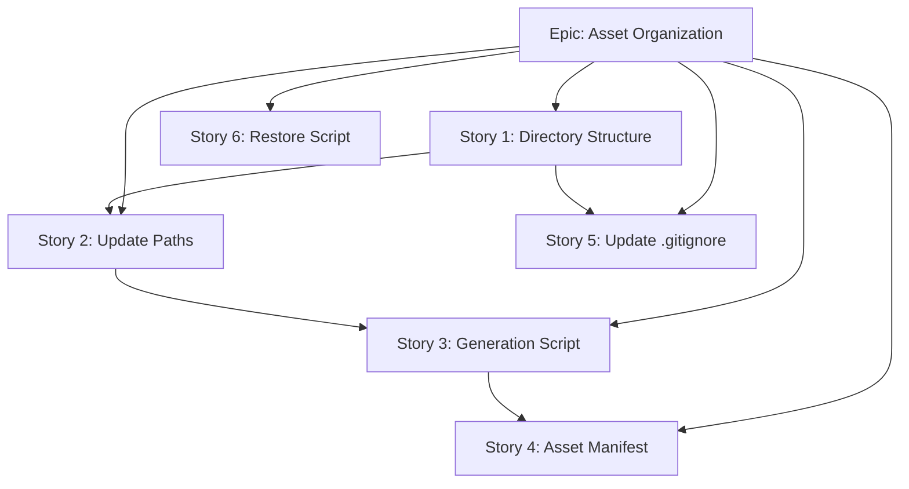

# Asset Organization Specification

## Overview

This specification defines the organization, management, and workflow for game assets in the pyglet-readme project. The goal is to separate assets from code, establish clear conventions, and create a reproducible pipeline for asset generation.

## Problem Statement

Current issues with asset management:

| Issue                     | Description                                                                                                      |
| ------------------------- | ---------------------------------------------------------------------------------------------------------------- |
| **Mixed concerns**        | Assets (`.png`, `.wav`, `.mp4`) live alongside Python source files in `src/pyglet_readme/`                       |
| **No categorization**     | All assets are in a flat directory with no organization by type or purpose                                       |
| **Manual generation**     | `mouse_sheet.png` is derived from `mouse.mp4` but the generation process is undocumented                         |
| **Inconsistent tracking** | Some assets are tracked (kitten.png, meow.wav), others are gitignored (ambience.wav, mouse_sheet.png, mouse.mp4) |
| **No metadata**           | Asset dimensions, frame counts, and audio specs are not documented                                               |
| **Size bloat**            | Large assets (8MB+ audio) increase clone times for tracked files                                                 |

## Current Asset Inventory

| File              | Type         | Size   | Tracked | Used For                                   |
| ----------------- | ------------ | ------ | ------- | ------------------------------------------ |
| `kitten.png`      | Image        | 861 KB | ✅ Yes  | Player sprite (scaled 10x down at runtime) |
| `mouse_sheet.png` | Sprite sheet | 953 KB | ❌ No   | Animated mouse (10x10 grid, 100 frames)    |
| `mouse.mp4`       | Video        | 1.2 MB | ❌ No   | Source for sprite sheet generation         |
| `meow.wav`        | Sound effect | 155 KB | ✅ Yes  | Kitten stop sound                          |
| `ambience.wav`    | Music        | 8.5 MB | ❌ No   | Background music loop                      |

## Proposed Directory Structure

```tree
src/pyglet_readme/
├── assets/
│   ├── images/
│   │   └── kitten.png
│   ├── sprites/
│   │   └── mouse_sheet.png
│   ├── audio/
│   │   ├── sfx/
│   │   │   └── meow.wav
│   │   └── music/
│   │       └── ambience.wav
│   └── source/                 # Raw/source files (gitignored)
│       └── mouse.mp4
├── __init__.py
├── hello_world.py
└── ...
```

### Benefits

1. **Clear separation**: Assets are isolated from source code
2. **Type-based organization**: Easy to find and manage specific asset types
3. **Scalable**: Structure supports adding more assets without clutter
4. **Source preservation**: Raw/source files are kept but gitignored

## Asset Tracking Policy

### Tracked in Git (< 500 KB)

- Essential small assets required for the app to run
- Examples: `kitten.png`, `meow.wav`

### Gitignored (>= 500 KB or derived)

- Large files that would bloat the repository
- Derived/generated files that can be recreated
- Examples: `ambience.wav`, `mouse_sheet.png`, `mouse.mp4`

### Alternative: Git LFS (Future)

For projects with many large tracked assets, consider Git LFS:

```bash
git lfs track "*.wav"
git lfs track "*.mp4"
```

## Asset Generation Pipeline

### Sprite Sheet Generation

The `mouse_sheet.png` sprite sheet is generated from `mouse.mp4` using ffmpeg.

**Script: `scripts/generate_assets.ps1`**

```powershell
#!/usr/bin/env pwsh
# Generate sprite sheet from video source

$SCRIPT_DIR = Split-Path -Parent $MyInvocation.MyCommand.Path
$PROJECT_ROOT = Split-Path -Parent $SCRIPT_DIR
$ASSETS_DIR = Join-Path $PROJECT_ROOT "src/pyglet_readme/assets"

# Parameters
$VIDEO_SOURCE = Join-Path $ASSETS_DIR "source/mouse.mp4"
$SPRITE_OUTPUT = Join-Path $ASSETS_DIR "sprites/mouse_sheet.png"
$GRID_COLS = 10
$GRID_ROWS = 10
$TOTAL_FRAMES = $GRID_COLS * $GRID_ROWS

# Extract frames
$TEMP_DIR = Join-Path $env:TEMP "pyglet_frames"
New-Item -ItemType Directory -Force -Path $TEMP_DIR | Out-Null

ffmpeg -i $VIDEO_SOURCE -vf "select='lt(n,$TOTAL_FRAMES)'" -vsync vfr "$TEMP_DIR/frame_%03d.png"

# Combine into sprite sheet using ImageMagick (montage)
montage "$TEMP_DIR/frame_*.png" -tile "${GRID_COLS}x${GRID_ROWS}" -geometry +0+0 $SPRITE_OUTPUT

# Cleanup
Remove-Item -Recurse -Force $TEMP_DIR

Write-Host "Generated: $SPRITE_OUTPUT"
```

### Missing Asset Restoration

For developers cloning fresh, provide a script to restore gitignored assets:

**Script: `scripts/restore_assets.ps1`**

```powershell
#!/usr/bin/env pwsh
# Restore missing assets from backup location or regenerate

param(
    [string]$BackupPath = ""
)

$ASSETS_DIR = Join-Path (Split-Path -Parent (Split-Path -Parent $MyInvocation.MyCommand.Path)) "src/pyglet_readme/assets"

$REQUIRED_ASSETS = @(
    @{ Path = "sprites/mouse_sheet.png"; Source = "GENERATE" },
    @{ Path = "audio/music/ambience.wav"; Source = "DOWNLOAD" },
    @{ Path = "source/mouse.mp4"; Source = "DOWNLOAD" }
)

foreach ($asset in $REQUIRED_ASSETS) {
    $fullPath = Join-Path $ASSETS_DIR $asset.Path
    if (-Not (Test-Path $fullPath)) {
        Write-Warning "Missing: $($asset.Path)"
        # TODO: Implement restore logic based on Source type
    }
}
```

## Asset Manifest

Create an `assets/manifest.yaml` to document asset metadata:

```yaml
# Asset Manifest - pyglet-readme
version: 1.0.0

images:
  kitten:
    path: images/kitten.png
    dimensions: [2048, 2048] # Original size
    runtime_scale: 0.1
    tracked: true

sprites:
  mouse:
    path: sprites/mouse_sheet.png
    dimensions: [1280, 1280]
    grid: [10, 10]
    frame_count: 100
    fps: 12
    tracked: false
    source: source/mouse.mp4

audio:
  sfx:
    meow:
      path: audio/sfx/meow.wav
      duration_ms: 1500
      tracked: true

  music:
    ambience:
      path: audio/music/ambience.wav
      duration_ms: 180000
      loop: true
      tracked: false
```

## Code Changes Required

Update asset loading paths in `hello_world.py`:

```python
# Before
image = pyglet.resource.image("kitten.png")
mouse_sheet = pyglet.resource.image("mouse_sheet.png")
meow_sound = pyglet.resource.media("meow.wav", streaming=False)
ambience_sound = pyglet.resource.media("ambience.wav")

# After
image = pyglet.resource.image("assets/images/kitten.png")
mouse_sheet = pyglet.resource.image("assets/sprites/mouse_sheet.png")
meow_sound = pyglet.resource.media("assets/audio/sfx/meow.wav", streaming=False)
ambience_sound = pyglet.resource.media("assets/audio/music/ambience.wav")
```

## Implementation Stories

### Story 1: Create Asset Directory Structure

Create the proposed directory structure and move existing assets.

### Story 2: Update Asset Loading Paths

Modify `hello_world.py` to load assets from new locations.

### Story 3: Create Asset Generation Script

Implement `scripts/generate_assets.ps1` for sprite sheet generation.

### Story 4: Create Asset Manifest

Add `assets/manifest.yaml` documenting all assets.

### Story 5: Update .gitignore

Update ignore patterns for new asset structure.

### Story 6: Create Asset Restoration Script (Optional)

Implement `scripts/restore_assets.ps1` for fresh clones.

## Verification Plan

1. **Move assets**: Relocate files to new structure
2. **Update code**: Modify resource paths
3. **Run application**: `uv run pyglet-readme` - verify all assets load
4. **Type check**: `uv run basedpyright` must pass
5. **Git status**: Verify tracked/untracked files are correct

## Dependencies


