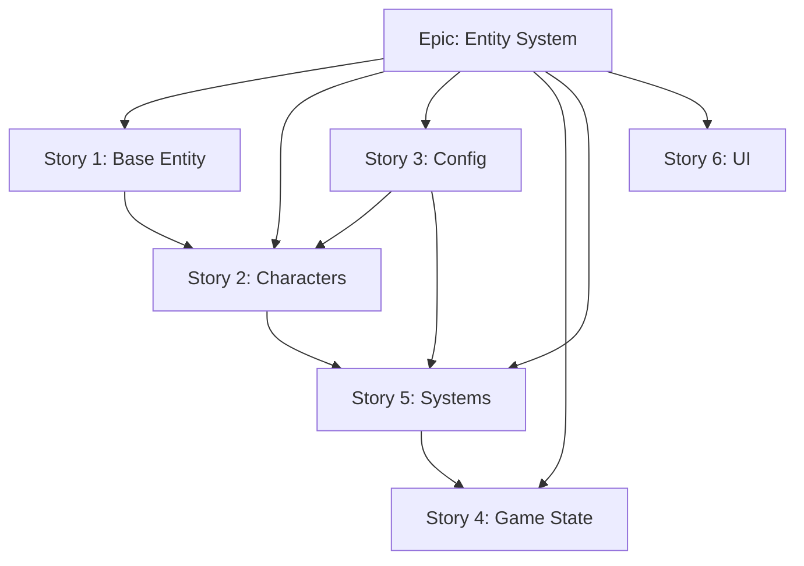

# Entity System Refactoring Specification

## Overview

Refactor `hello_world.py` from a monolithic function into a modular entity-component architecture following game development best practices.

## Problem Statement

Current implementation has:

- **God Function**: 294-line `run_hello_world()` containing all logic
- **No Entity Abstraction**: Mouse/Kitten represented as loose variables
- **Excessive Closures**: 6+ mutable variables shared via `nonlocal`
- **Magic Numbers**: Hardcoded values scattered throughout
- **Mixed Responsibilities**: Update function handles physics, AI, health, UI, win conditions

## Proposed Architecture

```tree
src/chaser_game/
├── main.py              # Entry point, window setup
├── config.py            # Constants: speeds, health, asset paths
├── entities/
│   ├── base.py          # Entity base class
│   ├── kitten.py        # Kitten-specific behavior
│   └── mouse.py         # Mouse-specific behavior
├── systems/
│   ├── health.py        # Health/stamina management
│   ├── collision.py     # Bounds checking, entity interaction
│   └── input.py         # Keyboard/mouse handlers
├── ui/
│   └── health_bar.py    # Health bar component
└── game.py              # Game class with state machine
```

## Entity Base Class

```python
from dataclasses import dataclass
from enum import Enum, auto

class EntityState(Enum):
    IDLE = auto()
    MOVING = auto()
    CHASING = auto()

@dataclass
class Entity:
    # Position
    x: float = 0.0
    y: float = 0.0

    # Velocity
    vx: float = 0.0
    vy: float = 0.0

    # Physics
    speed: float = 100.0
    acceleration: float = 0.0

    # State
    state: EntityState = EntityState.IDLE

    def update(self, dt: float) -> None:
        self.x += self.vx * dt
        self.y += self.vy * dt

    def clamp_to_bounds(self, bounds: tuple[float, float],
                        size: tuple[float, float]) -> None:
        self.x = max(0, min(bounds[0] - size[0], self.x))
        self.y = max(0, min(bounds[1] - size[1], self.y))
```

## Configuration Module

```python
# config.py
from dataclasses import dataclass

@dataclass(frozen=True)
class GameConfig:
    # Window
    WINDOW_WIDTH: int = 800
    WINDOW_HEIGHT: int = 600
    TARGET_FPS: float = 60.0

    # Movement
    BASE_SPEED_FACTOR: float = 10.0  # Cross window in N seconds
    MOUSE_SPEED_MULTIPLIER: float = 1.0
    KITTEN_SPEED_MULTIPLIER: float = 0.67
    JITTER_THRESHOLD: float = 2.0

    # Health System
    MAX_HEALTH: float = 100.0
    MAX_STAMINA: float = 100.0
    BASE_DRAIN_RATE: float = 20.0
    PASSIVE_STAMINA_DRAIN: float = 2.0
    LOW_HEALTH_THRESHOLD: float = 30.0

    # UI
    BAR_WIDTH: int = 50
    BAR_HEIGHT: int = 5
    BAR_OFFSET: int = 20

CONFIG = GameConfig()
```

## Game State Machine

```python
from enum import Enum, auto

class GameState(Enum):
    PLAYING = auto()
    PAUSED = auto()
    GAME_OVER_WIN = auto()
    GAME_OVER_LOSE = auto()
```

## Implementation Stories

### Story 1: Entity Base Class

Create `Entity` dataclass with position, velocity, acceleration, and state management.

### Story 2: Character Entities

Extend `Entity` for `Kitten` and `Mouse` with specific behaviors:

- **Kitten**: AI chase logic, stamina system
- **Mouse**: Player input handling, health system

### Story 3: Configuration Module

Extract all magic numbers into `config.py` with typed dataclass.

### Story 4: Game State Machine

Replace `game_over` boolean with proper `GameState` enum and transitions.

### Story 5: System Separation

Split update logic into focused systems:

- `health.py`: Damage calculation, stamina drain
- `collision.py`: Bounds checking, catch detection
- `input.py`: Keyboard/mouse event routing

### Story 6: UI Components

Extract health bar rendering into reusable `HealthBar` class.

## Dependencies



## Verification Plan

1. **Type Safety**: `uv run basedpyright` must pass
2. **Manual Testing**: Run game, verify identical behavior
3. **Unit Tests**: Add tests for entity movement, health calculations
